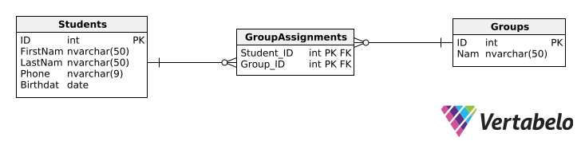

# Kolokwium 1 - Przykład
Czas: 1h25m

**Rozwiąż poniższe zadania.**

1. Utwórz prywatne repozytorium na platformie GitHub i udostępnij je prowadzącemu zajęcia. W repozytorium należy umieścić rozwiązanie zadania **2** po jego ukończeniu.
2. Utwórz webapi w technologii .NET, które będzie spełniało poniższe założenia:

    - API będzie operować na  poniższej bazie danych, zawierającej dane na temat przypisania studentów do poszczególnych grup studenckich.
      
   
    - Umożliwi wysyłanie zapytań http pod końcówkę **api/groups/{id}**, za pomocą której będzie można zobaczyć podstawowe informacje o danej grupie studenckiej.
      Przykładowe zapytanie:
      ```
      Request
      GET api/groups/1

      Response
      200
      {
          id: 1,
          name: "01c"
          students: [
              1,
              2,
              3
          ]
      }
      ```

    - Umożliwi wysyłanie zapytań http pod końcówkę **api/students/{id}**, za pomocą której będzie można usunąć danego studenta. Należy założyć, że w bazie danych **wyłączone** jest kaskadowe usuwanie rekordów.
      Przykładowe zapytanie:
      ```
      Request
      DELETE api/students/1

      Response
      204
      ```
      
## Pamiętaj o:
- Zwracaniu odpowiednich kodów http;
- Walidowaniu zapytań (jeżeli jest to wskazane);
- Programowaniu w sposób asynchroniczny;
- Utrzymywaniu porządku w kodzie;
- Wydzieleniu logiki bazodanowej do oddzielnej warstwy (repozytoria / serwis);
- Utworzeniu poprawnego pliku .gitignore przed dodaniem plików do repozytorium;
- Czasie!!!

## Ocenianie
Punktem wyjścia jest 100%. Za błędy w pracy odejmowana jest konkretna ilość punktów:
- -5% za każdy nieodpowiedni / niepoprawnie użyty kod http (max -15%);
- -45% za każdą brakującą końcówkę (max -90%);
- -10% za brak wydzielenia logiki bazodanowej do oddzielnej warstwy;
- programowanie w sposób synchroniczny (max -10%);
- brak walidacji (max -10%);
- nieczytelny kod (max -10%);
- -10% za zbędne pliki w repozytorium;
- -25% za ręczne zuploadowanie projektu do repozytorium.